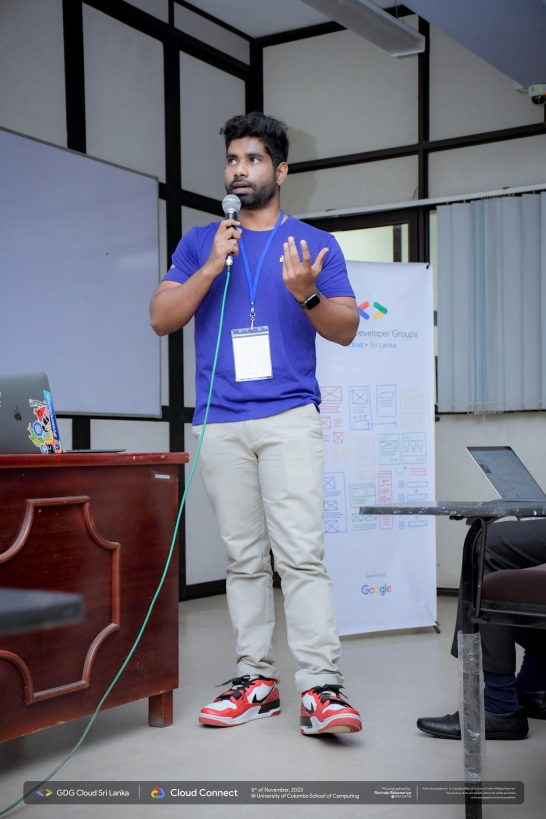
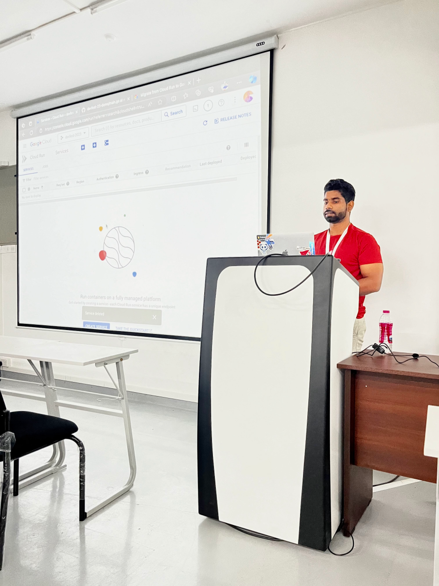

  

  

  
  
  
  
  
  
  
  

---

## About Me

I'm a **Software Engineer II** at [Circles Life](https://github.com/circleslife), passionate about cloud-native technologies, open source, and building developer communities across Sri Lanka and beyond. I live at the intersection of engineering and community leadership — shipping production Kubernetes workloads and organising events that bring the cloud-native ecosystem together.

- 💼 **Role:** Software Engineer II @ [@circleslife](https://github.com/circleslife)
- 🏅 **Also:** CNCF Ambassador · ex-GitHub Field Expert · GDG Organizer
- 🛠️ **Focus:** Golang · Kubernetes · TypeScript · Cloud Native · AI Infra
- 🌱 **Currently:** Deepening expertise in Golang & Kubernetes internals
- 👯 **Contributing to:** CNCF and cloud-native open source projects
- 📫 **Reach me at:** [chamodshehanka.com](https://chamodshehanka.com)
- 😄 **Pronouns:** He/Him
- ⚡ **Fun fact:** Sometimes I talk with my cat

---

## Community Leadership

  
  
  
  

| Community | Role           | Focus |
|-----------|----------------|-------|
| **Kubernetes Sri Lanka** 🇱🇰 | Lead           | Cloud Native & Kubernetes ecosystem |
| **KCD Sri Lanka** | Lead           | Kubernetes Community Days |
| **GDG Sri Lanka** | Lead           | Google Developer Group — Cloud & Web |
| **CNCF** | Ambassador     | Cloud Native Computing Foundation |

---

## Conference Speaking

International and regional conference speaker on cloud-native, Kubernetes, observability, and AI infrastructure.

### Talk Topics

| Session | Theme |
|---------|-------|
| Let's Talk to Your Cluster: LLM Agents Powered by Kubernetes MCP Server | AI + Kubernetes |
| Inferencing LLMs in Production with Kubernetes and KubeFlow | GenAI Infrastructure |
| Automating Microservice Scaling with KEDA and Google Vertex AI Predictions | AI + Autoscaling |
| From Black Box to Glass Box: Teaching Developers Tracing with New Relic Segments | Observability |
| Surfing the Waves of CI/CD: GKE, ArgoCD, and GitHub Actions | DevOps |
| Lessons from Running a CNCF Community: Mistakes, Wins, and Growth | Community |

### Upcoming & Recent Events

| Event | Location | When |
|-------|----------|------|
| ☸️ **KubeCon + CloudNativeCon India 2025** | Hyderabad, India | Aug 2025 |
| ☁️ **KCD Sri Lanka 2025** | Colombo, Sri Lanka | Oct 2025 |
| 🤖 **Build with AI Sri Lanka 2025** | Colombo, Sri Lanka | May 2025 |
| 🌏 **FOSSASIA Summit** | International | — |
| 💻 **Cloud Connect** | Regional | — |

  
  

  
  &nbsp;
  

---

## Content & Writing

  
  
  

I create tech content across YouTube, Instagram (`@techwchamod`), and write in-depth engineering articles on Medium covering cloud-native, Kubernetes, Golang, and DevOps.

### Latest Articles

<!-- BLOG-POST-LIST:START -->
<!-- BLOG-POST-LIST:END -->

  

---

## Tech Stack

**Cloud & DevOps**

  

**Languages & Frameworks**

  

**Tools**

  

---

## GitHub Stats

  
  

  

---

## 3D Contribution Graph

  

---

## Contribution Snake

  <picture>
    <source media="(prefers-color-scheme: dark)" srcset="https://raw.githubusercontent.com/chamodshehanka/chamodshehanka/output/github-contribution-grid-snake-dark.svg" />
    <source media="(prefers-color-scheme: light)" srcset="https://raw.githubusercontent.com/chamodshehanka/chamodshehanka/output/github-contribution-grid-snake.svg" />
    
  </picture>

  

